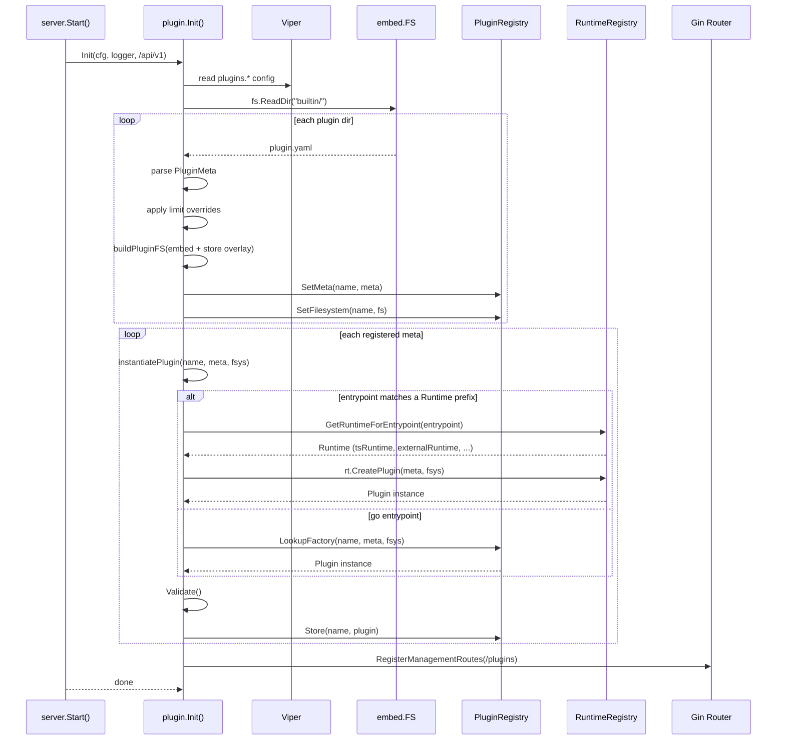
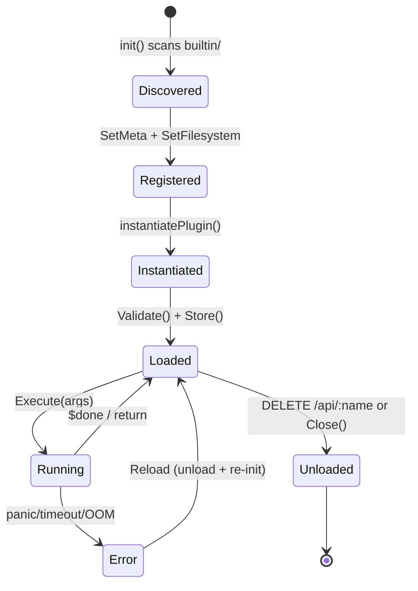
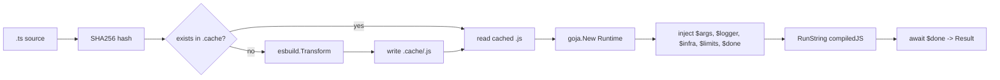

# `pkg/plugin/` — Plugin System Reference

## Overview

The plugin system allows dynamically loaded, sandboxed extensions embedded in the binary. Plugins can be pure Go types, TypeScript scripts (transpiled via **esbuild** and executed via **goja** at runtime), or **external-language** plugins (Python, etc. running as subprocesses via **gRPC**). Built-in plugins live under `builtin/` and are embedded via `//go:embed`. Runtime overrides are stored in `store/plugins/` on disk with a CopyOnWriteFs overlay.

### Files at a glance

| File | Role |
|------|------|
| `plugin.go` | `Plugin` interface, `Runtime` interface, `PluginMeta`, `ResourceLimits`, `Context`, `Result` |
| `registry.go` | `PluginRegistry` singleton — factory/meta/filesystem maps |
| `store.go` | `embed.FS` → `afero.Fs` adapter, `buildPluginFS()`, `ensureStoreDir()` |
| `sandbox.go` | Timeout enforcement, RSS memory monitor via gopsutil, panic recovery |
| `transpiler.go` | `TSCache` — SHA256 cache + esbuild TS→JS transpilation |
| `runtime.go` | `ScriptRuntime.Execute` — fresh goja VM, injected globals, script execution |
| `runtime_registry.go` | `Runtime` registry — prefix-based lookup for plugin execution engines |
| `tsplugin.go` | `TSScriptPlugin` + `tsRuntime` — TS-based plugin implementing `Runtime` for `ts:` prefix |
| `external_runtime.go` | `ExternalPlugin` + `externalRuntime` — gRPC-based runtime for `ext:` prefix (Python, etc.) |
| `bridge.go` | `PluginBridge` — `InfrastructureComponent` so services/infra can call plugins |
| `init.go` | `Init()` — entry point: config loading, builtin scanning, instantiation, route wiring |
| `gin.go` | 7 Gin REST handlers for plugin management |
| `embed.go` | `//go:embed builtin` directive |

---

## Core Types (`plugin.go`)

```go
type Plugin interface {
    Meta() PluginMeta
    Execute(ctx Context, args map[string]interface{}) (*Result, error)
    Validate() error
    Close() error
}
```

`PluginMeta` is the manifest struct loaded from `plugin.yaml`. Fields: `Name`, `Version`, `Description`, `Author`, `DependsOn`, `Entrypoint` (`"go:FuncName"`, `"ts:path/to/script.ts"`, or `"ext:path/to/script.py"`), `Limits`.

`Context` carries per-execution state: `ID`, `Logger`, `Registry` (infrastructure `ComponentRegistry`), `Cancel` func, and effective `Limits`.

`Result` is `{Success bool, Data interface{}, Error string}`.

---

## TypeScript Script Plugin (`tsplugin.go`)

When `entrypoint` starts with `ts:`, the system creates a `TSScriptPlugin` that:
1. Reads the `.ts` file from the plugin's afero filesystem
2. Compiles via `TSCache` (esbuild → SHA256 cache → `.js`)
3. Executes in a fresh goja VM with injected globals

No Go code needed for the plugin — just a `plugin.yaml` manifest and `.ts` files in `scripts/`.

Entrypoints: `"ts:scripts/handler.ts"` — the `tsRuntime` (registered in `tsplugin.go`) strips the `ts:` prefix and creates a `TSScriptPlugin`.

### Injected globals available in TypeScript

```
$args    → Record<string, any>     (user-supplied execution arguments)
$logger  → { info, warn, error, debug }
$limits  → { max_timeout_ms, max_memory_bytes }
$infra   → { get(name): any }      (access to infrastructure.ComponentRegistry)
$done    → callback({ success, data, error })
```

Reference types at `pkg/plugin/sdk/plugin.d.ts`. Drop this file in your IDE for autocompletion.

---

## External Language Plugin (`external_runtime.go`)

When `entrypoint` starts with `ext:`, the system creates an `ExternalPlugin` that:
1. Starts the plugin's language runtime as a subprocess (e.g., `python3 host.py`)
2. The subprocess starts a **gRPC** server on a Unix socket
3. The Go side connects via gRPC and sends `ExecuteRequest` containing the script source and args
4. The subprocess runs the plugin and returns `ExecuteResponse` with the result
5. The subprocess stays alive for subsequent calls (killed on `Close()`)

### gRPC contract (`plugin.proto`)

```protobuf
service PluginRuntime {
  rpc Execute(ExecuteRequest) returns (ExecuteResponse);
  rpc Ping(Empty) returns (Pong);
}

message ExecuteRequest {
  string name = 1;            // plugin name
  bytes args_json = 2;        // JSON-encoded execution args
  string script_source = 3;   // source code (loaded from store overlay)
}

message ExecuteResponse {
  bool success = 1;
  bytes data_json = 2;        // JSON-encoded result data
  string error = 3;
}
```

### Python plugin host

`scripts/plugins/python/host.py` acts as the gRPC server. It:
1. Accepts `--socket` and `--name` arguments
2. Starts a gRPC server on the given Unix socket
3. On `Execute()`: loads the Python script source, discovers the plugin class, runs it
4. Returns the result as `ExecuteResponse`

**Auto-discovery of SDK**: The host adds its own directory to `sys.path` on startup so loaded plugins can do `from sdk import Plugin` without fragile relative path traversal in `sys.path.insert()`.

**Improved module loading**: The host sets `__file__` and `__name__` on the loaded module so Python stdlib functions (like `os.path.dirname(__file__)`) work correctly inside plugin scripts, and error tracebacks show the plugin name.

**Plugin class detection**: `_find_plugin_class(module)` scans module attributes for classes that override `execute()` (skipping the base `Plugin` class itself and abstract methods).

**Lifecycle-aware execution**: If a plugin class has a `run()` method (new SDK), the host delegates to it for lifecycle management. Otherwise it falls back to direct `execute()` for backward compatibility with simple plugins.

### Python plugin SDK

`scripts/plugins/python/sdk.py` provides a base `Plugin` class with lifecycle hooks:

```python
from sdk import Plugin

class MyPlugin(Plugin):
    def setup(self, args):
        """Called before execute(). Raise to abort."""
        self.cache["start"] = time.time()

    def execute(self, args):
        """Override this with plugin logic."""
        name = args.get("name", "world")
        return {"success": True, "data": {"message": f"Hello, {name}!"}}

    def teardown(self, args, result):
        """Called after execute() for cleanup."""
        pass
```

**Instance attributes available to subclasses**:
| Attribute | Type | Purpose |
|-----------|------|---------|
| `self.name` | `str` | Plugin name, set by `configure()` |
| `self.logger` | `Logger` | Structured logger (`info`, `warn`, `error`, `debug`) |
| `self.state` | `dict` | Persistent state across executions (not reset between calls) |
| `self.cache` | `dict` | In-memory cache, cleared on plugin reload |

**SDK helper methods**:
| Method | Description |
|--------|-------------|
| `run(args)` | Lifecycle wrapper: `setup()` → `execute()` → `teardown()` with proper error handling |
| `elapsed_ms()` | Milliseconds spent in the last `run()` call |
| `get_state(key, default)` | Read from persistent state dict |
| `set_state(key, value)` | Write to persistent state dict |
| `clear_state()` | Reset all state |

The `Logger` class outputs structured log lines like:
```
[INFO] plugin.metric_computer: Computing metrics count=150 mode=compute
[WARN] plugin.webhook_transformer: Enrichment failed field=geo.type=geoip error=...
```

### Example

See `pkg/plugin/builtin/python_demo_plugin/` for a minimal Python plugin example.  
See the "Built-in Python Plugins" section below for advanced, multi-mode plugin examples.

Entrypoints: `"ext:scripts/handler.py"` — the `externalRuntime` (registered in `external_runtime.go`) strips the `ext:` prefix and creates an `ExternalPlugin`.

---

## Built-in Python Plugins

Five advanced Python plugins ship as built-ins. Each supports multiple execution modes and demonstrates a different capability of the external plugin runtime.

### `webhook_transformer` — Transform webhook payloads

Modes: `transform` (default), `filter`, `enrich`, `inspect`

**Transform mode** — apply field mappings with type conversions:
```bash
curl -s -X POST http://localhost:8080/api/v1/plugins/webhook_transformer/execute \
  -H 'Content-Type: application/json' \
  -d '{
    "args": {
      "mode": "transform",
      "payload": {"user": "  john  ", "email": "John@Example.COM", "age": "30"},
      "mappings": [
        {"from": "user", "to": "username", "transform": "trim"},
        {"from": "email", "to": "email", "transform": "lowercase"},
        {"from": "age", "to": "age", "transform": "to_int", "default": 0},
        {"from": "user", "to": "user_hash", "transform": "sha256"}
      ]
    }
  }' | jq
```

**Filter mode** — test payload against field conditions:
```bash
curl -s -X POST http://localhost:8080/api/v1/plugins/webhook_transformer/execute \
  -H 'Content-Type: application/json' \
  -d '{
    "args": {
      "mode": "filter",
      "payload": {"event": "user.created", "priority": "high", "retries": 3},
      "conditions": [
        {"field": "event", "op": "starts_with", "value": "user."},
        {"field": "priority", "op": "in", "value": ["high", "critical"]}
      ],
      "logic": "and"
    }
  }' | jq
```

**Enrich mode** — add computed fields (timestamps, UUIDs, hashes):
```bash
curl -s -X POST http://localhost:8080/api/v1/plugins/webhook_transformer/execute \
  -H 'Content-Type: application/json' \
  -d '{
    "args": {
      "mode": "enrich",
      "payload": {"order_id": "ORD-1234", "amount": 99.95},
      "enrichments": [
        {"field": "processed_at", "type": "timestamp", "params": {"format": "iso"}},
        {"field": "event_id", "type": "uuid", "params": {"version": 4}},
        {"field": "amount_hash", "type": "hash", "params": {"field": "amount", "algorithm": "md5"}}
      ]
    }
  }' | jq
```

**Inspect mode** — introspect payload structure (keys, types, depth):
```bash
curl -s -X POST http://localhost:8080/api/v1/plugins/webhook_transformer/execute \
  -H 'Content-Type: application/json' \
  -d '{
    "args": {
      "mode": "inspect",
      "payload": {"user": {"name": "Alice", "roles": ["admin", "editor"]}, "scores": [10, 20]}
    }
  }' | jq
```

Transform types: `copy`, `uppercase`, `lowercase`, `trim`, `split`, `join`, `prefix`, `suffix`, `template`, `regex_replace`, `to_int`, `to_float`, `to_string`, `to_bool`, `sha256`, `md5`, `uuid`.

Filter operators: `exists`, `not_exists`, `eq`, `neq`, `gt`, `gte`, `lt`, `lte`, `in`, `not_in`, `contains`, `starts_with`, `ends_with`, `matches` (regex), `is_type`, `len_gt`, `len_lt`.

Enrichment types: `timestamp` (iso/unix/unix_ms/date), `uuid` (v1/v4), `hash` (sha256/md5/sha1), `count`, `length`, `extract` (regex), `default`, `merge`.

### `data_processor` — Aggregate, filter, sort, and compute statistics

Modes: `aggregate` (default), `filter`, `sort`, `stats`, `batch`

**Aggregate mode** — group records by key with computed aggregations:
```bash
curl -s -X POST http://localhost:8080/api/v1/plugins/data_processor/execute \
  -H 'Content-Type: application/json' \
  -d '{
    "args": {
      "mode": "aggregate",
      "data": [
        {"dept": "eng", "role": "senior", "salary": 120000},
        {"dept": "eng", "role": "junior", "salary": 80000},
        {"dept": "ops", "role": "senior", "salary": 110000},
        {"dept": "ops", "role": "junior", "salary": 70000}
      ],
      "group_by": ["dept"],
      "aggregations": [
        {"field": "salary", "op": "avg", "alias": "avg_salary"},
        {"field": "salary", "op": "sum", "alias": "total_salary"},
        {"field": "salary", "op": "max", "alias": "max_salary"},
        {"field": "salary", "op": "stddev", "alias": "salary_stddev"}
      ]
    }
  }' | jq
```

**Filter mode** — compound condition filtering with and/or/not logic:
```bash
curl -s -X POST http://localhost:8080/api/v1/plugins/data_processor/execute \
  -H 'Content-Type: application/json' \
  -d '{
    "args": {
      "mode": "filter",
      "data": [{"name": "A", "age": 25, "active": true}, {"name": "B", "age": 17, "active": true}],
      "conditions": [
        {"field": "age", "op": "gt", "value": 18},
        {"field": "active", "op": "eq", "value": true}
      ],
      "logic": "and"
    }
  }' | jq
```

**Stats mode** — full statistical profile of a numeric field:
```bash
curl -s -X POST http://localhost:8080/api/v1/plugins/data_processor/execute \
  -H 'Content-Type: application/json' \
  -d '{
    "args": {
      "mode": "stats",
      "data": [{"value": 10}, {"value": 20}, {"value": 30}, {"value": 40}, {"value": 100}],
      "field": "value"
    }
  }' | jq
```

**Batch mode** — split a large array into smaller chunks:
```bash
curl -s -X POST http://localhost:8080/api/v1/plugins/data_processor/execute \
  -H 'Content-Type: application/json' \
  -d '{
    "args": {
      "mode": "batch",
      "data": [1,2,3,4,5,6,7,8,9,10],
      "batch_size": 3
    }
  }' | jq
```

Aggregation operations: `count`, `sum`, `avg`, `min`, `max`, `first`, `last`, `unique`, `concat`, `stddev`, `variance`, `range`, `median`.

Filter operators: `exists`, `not_exists`, `eq`, `neq`, `gt`, `gte`, `lt`, `lte`, `in`, `contains`, `between`, `is_null`, `not_null`, `matches`.

### `template_renderer` — String template rendering with validation

Modes: `render` (default), `validate`, `list_vars`

**Render mode** — substitute variables into templates (multiple engines):
```bash
curl -s -X POST http://localhost:8080/api/v1/plugins/template_renderer/execute \
  -H 'Content-Type: application/json' \
  -d '{
    "args": {
      "mode": "render",
      "template": "Hello, ${name}! Your order #${order.id} is ${status}.",
      "variables": {"name": "Alice", "order": {"id": "ORD-42"}, "status": "shipped"},
      "engine": "string_template"
    }
  }' | jq
```

**Validate mode** — check template for undefined variables and syntax errors:
```bash
curl -s -X POST http://localhost:8080/api/v1/plugins/template_renderer/execute \
  -H 'Content-Type: application/json' \
  -d '{
    "args": {
      "mode": "validate",
      "template": "Hello, ${name}! Your ${status} is ${undefined_var}.",
      "variables": {"name": "Bob", "status": "active"}
    }
  }' | jq
```

**List variables mode** — extract all variable placeholders from a template:
```bash
curl -s -X POST http://localhost:8080/api/v1/plugins/template_renderer/execute \
  -H 'Content-Type: application/json' \
  -d '{
    "args": {
      "mode": "list_vars",
      "template": "Hello ${user.name}, your order ${order.id} is ${status}"
    }
  }' | jq
```

Engines: `string_template` (default, Python `string.Template` with nested dot-notation support), `format` (Python `str.format()`), `percent` (Python `%` formatting).

### `schema_validator` — Validate and coerce data against a type schema

Modes: `validate` (default), `coerce`, `describe`

**Validate mode** — check data against type rules with constraints:
```bash
curl -s -X POST http://localhost:8080/api/v1/plugins/schema_validator/execute \
  -H 'Content-Type: application/json' \
  -d '{
    "args": {
      "mode": "validate",
      "data": {
        "name": "Alice",
        "age": 25,
        "email": "alice@example.com",
        "role": "admin",
        "tags": ["python"]
      },
      "schema": {
        "name": {"type": "string", "required": true, "min_length": 2, "max_length": 100},
        "age": {"type": "integer", "required": true, "minimum": 0, "maximum": 150},
        "email": {"type": "email", "required": true},
        "role": {"type": "string", "enum": ["admin", "user", "moderator"]},
        "tags": {"type": "array", "min_items": 1, "max_items": 20},
        "address": {"type": "object", "properties": {
          "street": {"type": "string"},
          "city": {"type": "string"}
        }}
      }
    }
  }' | jq
```

**Coerce mode** — validate AND convert types:
```bash
curl -s -X POST http://localhost:8080/api/v1/plugins/schema_validator/execute \
  -H 'Content-Type: application/json' \
  -d '{
    "args": {
      "mode": "coerce",
      "data": {"name": "Bob", "age": "30", "active": "true"},
      "schema": {
        "name": {"type": "string"},
        "age": {"type": "integer", "default": 0},
        "active": {"type": "boolean", "default": false}
      }
    }
  }' | jq
```

**Describe mode** — human-readable schema documentation:
```bash
curl -s -X POST http://localhost:8080/api/v1/plugins/schema_validator/execute \
  -H 'Content-Type: application/json' \
  -d '{
    "args": {
      "mode": "describe",
      "schema": {
        "name": {"type": "string", "required": true, "description": "User full name"},
        "age": {"type": "integer", "minimum": 0, "maximum": 150}
      }
    }
  }' | jq
```

Supported types: `string`, `integer`, `number`, `boolean`, `array`, `object`, `null`, `any`, `email`, `url`, `date`, `ipv4`.

Constraints: `required`, `min_length`, `max_length`, `minimum`, `maximum`, `exclusive_minimum`, `exclusive_maximum`, `pattern` (regex), `enum`, `min_items`, `max_items`, `default`.

### `metric_computer` — Compute aggregation metrics and sliding windows

Modes: `compute` (default), `percentile`, `window`, `derive`

**Compute mode** — full aggregation profile (sum, avg, stddev, trend, rate):
```bash
curl -s -X POST http://localhost:8080/api/v1/plugins/metric_computer/execute \
  -H 'Content-Type: application/json' \
  -d '{
    "args": {
      "mode": "compute",
      "values": [10, 20, 30, 40, 50, 60, 70, 80, 90, 100],
      "timestamps": [0, 1, 2, 3, 4, 5, 6, 7, 8, 9]
    }
  }' | jq
```

Response includes: `sum`, `avg`, `min`, `max`, `range`, `median`, `p90`, `p95`, `p99`, `variance`, `stddev`, `cv`, `rate_per_second`, `avg_delta`, `max_delta`, `trend`, `trend_magnitude`.

**Percentile mode** — compute arbitrary percentiles:
```bash
curl -s -X POST http://localhost:8080/api/v1/plugins/metric_computer/execute \
  -H 'Content-Type: application/json' \
  -d '{
    "args": {
      "mode": "percentile",
      "values": [1,2,3,4,5,6,7,8,9,10,11,12,13,14,15,16,17,18,19,20],
      "percentiles": [25, 50, 75, 90, 95, 99, 99.9]
    }
  }' | jq
```

**Window mode** — sliding window computations:
```bash
curl -s -X POST http://localhost:8080/api/v1/plugins/metric_computer/execute \
  -H 'Content-Type: application/json' \
  -d '{
    "args": {
      "mode": "window",
      "values": [10, 12, 15, 13, 18, 20, 22, 25, 23, 21],
      "window_type": "sma",
      "window_size": 3
    }
  }' | jq
```

Window types: `sma` (simple moving average), `ema` (exponential moving average with configurable `smoothing`), `cumulative` (cumulative running average).

**Derive mode** — computed metrics from raw data:
```bash
curl -s -X POST http://localhost:8080/api/v1/plugins/metric_computer/execute \
  -H 'Content-Type: application/json' \
  -d '{
    "args": {
      "mode": "derive",
      "values": [100, 105, 102, 110, 108, 115],
      "derivations": ["delta", "pct_change", "zscore", "cumulative_sum", "normalize"]
    }
  }' | jq
```

Derivation types: `delta` (sequential differences), `pct_change` (percent change), `ratio` (element-wise division), `rate_of_change` (requires timestamps), `zscore` (with outlier detection), `cumulative_sum`, `log`, `normalize` (0-1 min-max scaling).

---

## Runtime Registry (`runtime_registry.go`)

The `Runtime` interface is the extension point for adding new plugin execution engines:

```go
type Runtime interface {
    Prefix() string                           // unique prefix like "ts:", "ext:"
    CreatePlugin(meta PluginMeta, fs afero.Fs) (Plugin, error)
}
```

Runtimes self-register via `init()`:

```go
func init() { RegisterRuntime(&externalRuntime{}) }
```

`instantiatePlugin()` in `init.go` now delegates to `GetRuntimeForEntrypoint(entrypoint)` instead of hardcoding TS logic. If no runtime matches, it falls back to the Go factory pattern.

---

## Go Plugin (`registry.go` + factory pattern)

For Go-based plugins, register a `PluginFactory` via `init()`:

```go
func init() {
    RegisterPlugin("myplugin", func(meta PluginMeta, fs afero.Fs) (Plugin, error) {
        return &MyPlugin{fs: fs}, nil
    })
}
```

The factory receives the parsed `PluginMeta` and a per-plugin afero `Fs` (embed + overlay). The plugin must implement the `Plugin` interface. **Important**: because Go packages cannot have `.go` files with the same `package` declaration in nested directories, register Go plugins from flat files directly inside `pkg/plugin/` (e.g., a file named `plugin_myplugin.go`). Subdirectories under `builtin/` hold only `plugin.yaml` + `.ts` scripts (no `.go` files).

---

## Init Flow

Called from `internal/server/server.go:105`:

```go
pluginGroup := s.gin.Group("/api/v1")
plugin.Init(s.config, s.logger, pluginGroup)
```



---

## Lifecycle States



- **Discovered**: plugin.yaml found and parsed
- **Registered**: meta + filesystem stored in registry
- **Instantiated**: Plugin instance created from factory or TSScriptPlugin
- **Loaded**: Validated and stored in `plugins` map
- **Running**: `Execute()` in progress
- **Error**: Execution failed (panic recovered, timeout, OOM)
- **Unloaded**: `Close()` called, entry removed from registry

---

## Afero Filesystem Layers (`store.go`)

Each plugin gets a layered filesystem:

```
Layer 1 (base, read-only) :  embed.FS (builtin/{name}/)
Layer 2 (overlay, writable): os.DirFS(store/plugins/{name}/ on disk)
    → Combined via afero.NewCopyOnWriteFs
    → .ts files in store/{name}/scripts/ shadow builtin versions
    → Gin PUT writes new .ts to the writable overlay
    → .cache/ is in the overlay for compiled JS artifacts
```

Directory layout per plugin:
```
store/plugins/{name}/
    scripts/      — hot-replaceable .ts files (overlay)
    .cache/       — esbuild output, keyed by SHA256(source).js
    config/       — plugin-specific config (future use)
    data/         — plugin working data (future use)
```

---

## Sandbox (`sandbox.go`)

Two guard mechanisms, both running in-goroutine:

| Mechanism | Implementation | Trigger |
|-----------|---------------|---------|
| **Timeout** | `context.WithTimeout` → cancels when exceeded | `limits.max_timeout_ms` |
| **OOM** | `gopsutil/v3/process.MemoryInfo` polling every 500ms | `limits.max_memory_bytes` RSS |

`PluginSandbox.ExecuteWithGuard` wraps both. Panics are recovered and returned as errors. Hard caps from config always override per-plugin limits.

---

## Transpilation Pipeline (`transpiler.go` + `runtime.go`)



- Cache key: `SHA256(source)`
- Cache file: `.cache/{sha256}.js` in the plugin's afero overlay
- Transpile target: es2020
- Each `Execute()` creates a fresh goja VM (no state sharing)

---

## Gin REST API (`gin.go`)

Registered at `Init()` on `/api/v1/plugins`.  
All examples target the built-in `inspector` plugin on `localhost:8080`.

### `GET /api/v1/plugins` — List all plugins

```bash
curl -s http://localhost:8080/api/v1/plugins | jq
```

```json
{
  "plugins": [
    {
      "name": "inspector",
      "version": "1.0.0",
      "description": "Queries all active infrastructure components ...",
      "status": "loaded"
    }
  ]
}
```

---

### `GET /api/v1/plugins/:name` — Plugin detail

```bash
curl -s http://localhost:8080/api/v1/plugins/inspector | jq
```

```json
{
  "name": "inspector",
  "version": "1.0.0",
  "description": "Queries all active infrastructure components ...",
  "author": "stackyrd",
  "entrypoint": "ts:scripts/handler.ts",
  "type": "typescript",
  "depends_on": [],
  "limits": {
    "max_timeout_ms": 15000,
    "max_memory_bytes": 33554432
  },
  "status": "loaded"
}
```

---

### `POST /api/v1/plugins/:name/execute` — Execute a plugin

**Aggregator plugin** — full-featured demo with 4 modes:

Dashboard mode (default) — inspect all components with latency:

```bash
curl -s -X POST http://localhost:8080/api/v1/plugins/aggregator/execute \
  -H 'Content-Type: application/json' \
  -d '{"args": {"mode": "dashboard"}}' | jq
```

```json
{
  "success": true,
  "data": {
    "mode": "dashboard",
    "runtime": { "elapsed_ms": 8, "limits": { "max_timeout_ms": 20000, "max_memory_bytes": 67108864 } },
    "summary": { "total": 7, "healthy": 1, "degraded": 1, "down": 5 },
    "components": [
      { "name": "redis", "available": true, "status": { "connected": true }, "latency_ms": 1, "error": null },
      { "name": "postgres", "available": true, "status": { "connected": true }, "latency_ms": 3, "error": "GetStatus failed: ..." },
      { "name": "kafka", "available": false, "status": null, "latency_ms": null, "error": null }
    ]
  }
}
```

Query mode — run a command against a single component:

```bash
curl -s -X POST http://localhost:8080/api/v1/plugins/aggregator/execute \
  -H 'Content-Type: application/json' \
  -d '{"args": {"mode": "query", "component": "redis", "command": "status"}}' | jq
```

Transform mode — apply string operations to fields:

```bash
curl -s -X POST http://localhost:8080/api/v1/plugins/aggregator/execute \
  -H 'Content-Type: application/json' \
  -d '{
    "args": {
      "mode": "transform",
      "input": { "name": "  hello world  ", "role": "admin" },
      "rules": [
        { "field": "name", "operation": "uppercase" },
        { "field": "name", "operation": "trim" },
        { "field": "role", "operation": "prefix", "value": "role_" }
      ]
    }
  }' | jq
```

```json
{
  "success": true,
  "data": {
    "mode": "transform",
    "runtime": { "elapsed_ms": 1, "limits": { "max_timeout_ms": 20000, "max_memory_bytes": 67108864 } },
    "original": { "name": "  hello world  ", "role": "admin" },
    "transformed": { "name": "  HELLO WORLD  ", "role": "role_admin" },
    "applied_rules": 3
  }
}
```

Echo mode — connectivity test:

```bash
curl -s -X POST http://localhost:8080/api/v1/plugins/aggregator/execute \
  -H 'Content-Type: application/json' \
  -d '{"args": {"mode": "echo", "custom_field": "test"}}' | jq
```

**Inspector plugin** — lightweight infra ping:

```bash
curl -s -X POST http://localhost:8080/api/v1/plugins/inspector/execute \
  -H 'Content-Type: application/json' \
  -d '{"args": {"mode": "ping"}}' | jq
```

Status-mode with specific components:

```bash
curl -s -X POST http://localhost:8080/api/v1/plugins/inspector/execute \
  -H 'Content-Type: application/json' \
  -d '{"args": {"mode": "status", "components": ["redis", "postgres"]}}' | jq
```

Response shape:

```json
{
  "success": true,
  "data": {
    "elapsed_ms": 12,
    "mode": "ping",
    "summary": { "total": 7, "available": 2, "unavailable": 5 },
    "components": [
      {
        "name": "redis",
        "available": true,
        "status": {
          "name": "Redis",
          "connected": true,
          "pool_size": 10,
          "uptime": "5m"
        },
        "error": null
      }
    ],
    "limits": { "max_timeout_ms": 15000, "max_memory_bytes": 33554432 }
  }
}
```

---

### `PUT /api/v1/plugins/:name/scripts/:file` — Upload/replace a script

```bash
curl -s -X PUT http://localhost:8080/api/v1/plugins/inspector/scripts/handler.ts \
  -H 'Content-Type: application/json' \
  -d '{"content": "function handler() { $done({success: true, data: {msg: \"hello\"}}); } handler();"}' | jq
```

```json
{
  "message": "script uploaded",
  "path": "scripts/handler.ts"
}
```

The file is written to the on-disk overlay (`store/plugins/inspector/scripts/handler.ts`), shadowing the built-in version. The next `execute` call will transpile the new source.

---

### `GET /api/v1/plugins/:name/scripts` — List scripts

```bash
curl -s http://localhost:8080/api/v1/plugins/inspector/scripts | jq
```

```json
{
  "scripts": ["handler.ts"]
}
```

---

### `GET /api/v1/plugins/:name/scripts/:file` — Get script source

```bash
curl -s http://localhost:8080/api/v1/plugins/inspector/scripts/handler.ts | jq
```

```json
{
  "name": "handler.ts",
  "content": "function handler(): void {\n    const input = $args.input || \"world\";\n    ...\n}"
}
```

---

### `DELETE /api/v1/plugins/:name` — Unload a plugin

```bash
curl -s -X DELETE http://localhost:8080/api/v1/plugins/inspector | jq
```

```json
{
  "message": "plugin unloaded",
  "name": "inspector"
}
```

After unloading, the plugin is removed from the registry. It will be re-discovered on next app restart (or programmatic re-init).

---

## Configuration (`config.yaml`)

```yaml
plugins:
  enabled: true
  default_limits:
    max_timeout_ms: 30000
    max_memory_bytes: 104857600         # 100 MB
  overrides:
    example:
      max_timeout_ms: 10000
```

Viper keys: `plugins.enabled`, `plugins.default_limits.max_timeout_ms`, `plugins.overrides.{name}.max_timeout_ms`. Overrides are applied per-plugin on top of defaults. The hard cap acts as an absolute maximum — if a plugin.yaml or override sets limits higher, they are clamped.

---

## Adding a New Plugin

### TypeScript plugin (recommended for dynamic logic)

1. Create `pkg/plugin/builtin/{name}/plugin.yaml`:
   ```yaml
   name: myplugin
   version: 1.0.0
   description: My plugin
   entrypoint: "ts:scripts/handler.ts"
   limits:
     max_timeout_ms: 5000
     max_memory_bytes: 26214400
   ```
2. Create `pkg/plugin/builtin/{name}/scripts/handler.ts` using `$args`, `$logger`, `$done`.
3. Optionally add `pkg/plugin/sdk/plugin.d.ts` to your project for IDE support.

### External language plugin (Python, etc. via gRPC)

1. Create `pkg/plugin/builtin/{name}/plugin.yaml`:
    ```yaml
    name: mypythonplugin
    version: 1.0.0
    description: My Python plugin
    entrypoint: "ext:scripts/handler.py"
    limits:
      max_timeout_ms: 15000
      max_memory_bytes: 33554432
    ```
2. Create `pkg/plugin/builtin/{name}/scripts/handler.py` with a class extending `Plugin`:
    ```python
    from sdk import Plugin

    class MyPythonPlugin(Plugin):
        def execute(self, args):
            name = args.get("name", "world")
            return {
                "success": True,
                "data": {"message": f"Hello from Python, {name}!"}
            }
    ```
3. The Python host (`scripts/plugins/python/host.py`) loads the script via gRPC
4. See `scripts/plugins/python/sdk.py` for the base `Plugin` class

**Using lifecycle hooks** (automatic via `run()`):
```python
from sdk import Plugin

class StatefulPlugin(Plugin):
    def setup(self, args):
        self.cache["start"] = time.time()
        if "counter" not in self.state:
            self.state["counter"] = 0

    def execute(self, args):
        self.state["counter"] += 1
        self.logger.info("Invoked", count=self.state["counter"])
        return {"success": True, "data": {"count": self.state["counter"]}}

    def teardown(self, args, result):
        elapsed = time.time() - self.cache.get("start", 0)
        self.logger.debug("Completed", elapsed_ms=round(elapsed * 1000))
```

### Go plugin (when native performance or infra access is needed)

1. Create `pkg/plugin/plugin_{name}.go` (flat file in `pkg/plugin/`):
   - Implement `Plugin` interface
   - Register via `init()`: `RegisterPlugin("name", factory)`
2. Create `pkg/plugin/builtin/{name}/plugin.yaml` with `entrypoint: "go:MyFunc"`.
3. (Optional) Create `pkg/plugin/builtin/{name}/structs.go` for config types.

### All approaches

- The plugin is auto-discovered at startup via `//go:embed builtin`
- Runtime script overrides can be uploaded via `PUT /api/v1/plugins/:name/scripts/:file`
- Config overrides can be set in `config.yaml` → `plugins.overrides`

---

## Key Constraints & Gotchas

- **No `.go` files in `builtin/` subdirectories**: Go requires all `.go` files with the same `package` declaration to be in the same directory. Nesting `.go` files under `builtin/{name}/` with `package plugin` does not compile. Place Go plugin registration in flat files within `pkg/plugin/` directly (e.g., `pkg/plugin/plugin_myplugin.go`).
- **Cache directory**: The `.cache/` dir lives in the *overlay* filesystem (`store/plugins/{name}/.cache/`), not in the embed. On first run, all `.ts` files are transpiled and cached. If the overlay is deleted, caches are rebuilt.
- **Fresh VM per call**: `goja.Runtime` is created for every `Execute()` call. No JS state persists between executions.
- **External plugin subprocess lifecycle**: The Python host process is started on the first `Execute()` call and killed on `Close()`. Plugin crash causes the host to restart on the next call.
- **Global loggers/registry**: `plugin.Init()` stores `globalLogger` and `globalInfraRegistry` as package vars accessed by Gin handlers. These are set at boot and must not be nil when handlers fire.
- **Plugin order**: `plugin.Init()` runs *before* `AutoDiscoverServices` in `server.go`, so the `PluginBridge` is available in service `Dependencies` at construction time.
- **Infra readiness**: Infrastructure components are initialized asynchronously and may not be fully ready when a plugin's `Execute()` first runs — the plugin developer should handle this gracefully (the `inspector` plugin already does: it sets `available: false` for components that return nil).
- **No plugin hot-reload yet**: `DELETE + re-registration` is manual via the API. A file watcher for the overlay directory is future work.
- **Embed path**: The `//go:embed builtin` directive in `embed.go` embeds the entire `builtin/` directory tree. The `builtinFS` variable must use the `embed` package type and is set via `SetBuiltinFS()` in an `init()` function in the same file.
- **Runtime prefixes must be unique**: Two runtimes cannot share the same prefix (e.g., only one `"ts:"` runtime). The `RegisterRuntime` function panics on duplicate prefix registration.
- **Python gRPC dependencies**: Python plugins require `grpcio` and `protobuf` installed. The host script at `scripts/plugins/python/host.py` uses the generated `plugin_pb2.py` and `plugin_pb2_grpc.py` stubs.
- **External plugin environment**: Set `PLUGIN_PYTHON_HOST` env var to override the path to `host.py`. The `python3` binary is used by default.
- **Python SDK import path**: The host automatically adds its own directory to `sys.path` so plugins can `from sdk import Plugin` without path manipulation. Plugins should NOT use fragile relative `sys.path.insert()` to find the SDK.
- **Python plugin lifecycle**: The new SDK provides `setup()` → `execute()` → `teardown()` via the `run()` method. The host detects `run()` and delegates to it; if absent, it calls `execute()` directly (backward compatible with old-style plugins).
- **Python plugin state**: `self.state` persists across executions within the same host process. `self.cache` is per-instance and reset on plugin reload. Do not rely on module-level globals for state — they may be reset if the module is reloaded.
- **Python subprocess lifecycle**: The Python host process is started on the first `Execute()` call and stays alive for subsequent calls. It is killed on `Close()`. If the process crashes, `ensureRunning()` restarts it on the next call. Unix socket path includes a nanosecond timestamp for uniqueness: `/tmp/plugin-{name}-{timestamp}.sock`.
- **Python plugin module caching**: The host caches the loaded module after the first `Execute()` call. Module code is not reloaded between calls within the same host process. To force a reload, unload the plugin (`DELETE /api/v1/plugins/{name}`) and execute again.
- **Python stdlib only**: Python plugins can use any stdlib module. Third-party packages beyond `grpcio` and `protobuf` are not installed in the Docker image by default. Add them to the Dockerfile if needed.
- **Python plugin errors**: Unhandled exceptions in `execute()` are caught by the SDK's `run()` method, logged, and returned as `{success: false, error: "ExceptionType: message", data: {traceback: "..."}}`. The host wraps unknown exceptions similarly.
- **No infra access from Python**: Unlike TypeScript plugins (which have `$infra.get(name)`), Python plugins do not have direct access to Go-side infrastructure components. All required data must be passed via `args`. This is by design — Python is a separate process communicating over gRPC.
