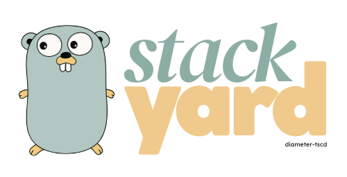
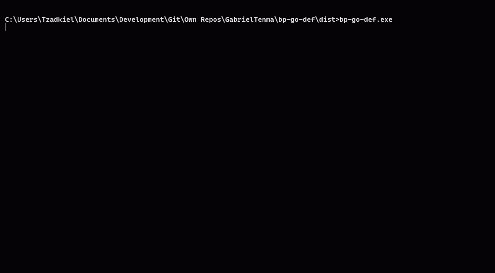

<div align="center">
  
</div>
<div align="center">
  
  
  
  
</div>
<br>

Stackyard is a lightweight, production-ready application framework featuring modular architecture, comprehensive monitoring, real-time dashboards, and extensive infrastructure integrations. Built for scalability and ease of deployment.

## Quick Start

### Prerequisites
- Go 1.21+

### Installation & Run

```bash
# Clone the repository
git clone https://github.com/diameter-tscd/stackyard.git
cd stackyard

# Install dependencies
go mod download

# Run the application
go run cmd/app/main.go
```

**First Access:**
1. Open `http://localhost:9090` (monitoring dashboard)
2. Login with password: `admin`
3. **Important**: Change the default password immediately!

## Screenshots

### Backend Console


### Monitoring Dashboard


## Key Features

- **Modular Services**: Enable/disable services via configuration
- **Monitoring Dashboard**: Real-time metrics, logs, and system monitoring
- **Terminal UI**: Interactive boot sequence and live CLI dashboard
- **Infrastructure Support**: Redis, PostgreSQL (multi-tenant), Kafka, MinIO
- **Security**: API encryption, authentication, and access controls
- **Build Tools**: Automated build scripts with backup and archiving

## Documentation

**[Full Documentation](docs_wiki/)** - Comprehensive guides and references

### Core Documentation
- **[Configuration Guide](docs_wiki/CONFIGURATION_GUIDE.md)** - Complete configuration reference
- **[API Response Structure](docs_wiki/API_RESPONSE_STRUCTURE.md)** - Standard response formats
- **[Architecture Diagrams](docs_wiki/ARCHITECTURE_DIAGRAMS.md)** - System design and flow diagrams
- **[Service Implementation](docs_wiki/SERVICE_IMPLEMENTATION.md)** - How to add new services

### Infrastructure & Integration
- **[Integration Guide](docs_wiki/INTEGRATION_GUIDE.md)** - Redis, PostgreSQL, Kafka, MinIO setup
- **[Build Scripts](docs_wiki/BUILD_SCRIPTS.md)** - Production deployment automation
- **[Package Management](docs_wiki/CHANGE_PACKAGE_SCRIPTS.md)** - Module renaming tools

### Security & Features
- **[API Encryption](docs_wiki/ENCRYPTION_API.md)** - End-to-end encryption
- **[API Obfuscation](docs_wiki/API_OBFUSCATION.md)** - Data obfuscation mechanisms
- **[TUI Implementation](docs_wiki/TUI_IMPLEMENTATION.md)** - Terminal interface details

## Project Structure

```
stackyard/
├── .github/                 # GitHub Actions CI/CD workflows
│   └── workflows/          # Automated testing and deployment
├── cmd/                     # Application entry points
│   └── app/                # Main application executable
├── config/                  # Configuration management
├── docs_wiki/              # Comprehensive project documentation
│   └── blueprint/          # Project architecture analysis
├── internal/                # Private application packages
│   ├── middleware/         # HTTP middleware (auth, security)
│   ├── monitoring/         # Web monitoring dashboard backend
│   ├── server/             # HTTP server setup and routing
│   └── services/           # Modular business services
│       └── modules/        # Individual service implementations
├── pkg/                    # Public reusable packages
│   ├── infrastructure/     # External service integrations
│   ├── logger/             # Structured logging utilities
│   ├── request/            # Request validation and binding
│   ├── response/           # Standardized API responses
│   ├── tui/                # Terminal User Interface components
│   └── utils/              # General utility functions
├── scripts/                # Build and utility scripts
└── web/                    # Web interface assets
    └── monitoring/         # Monitoring dashboard frontend
        └── assets/         # Static web assets
            ├── css/        # Stylesheets
            └── js/         # JavaScript files
```

## License

Apache License Version 2.0: [LICENSE](LICENSE)

---

**Built with 🐸 using Go, Echo, Alpine.js, Tailwind CSS**
