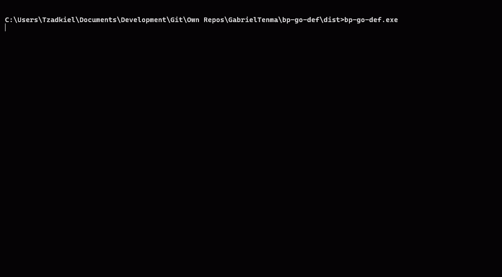

<div align="center">
  
</div>
<div align="center">
  
  
  
  
</div>
<br>

stackyrd is a production-ready application framework featuring modular architecture, comprehensive monitoring, real-time dashboards, and extensive infrastructure integrations. Built for scalability and ease of deployment.

## Quick Start

### Prerequisites
- Go 1.21+

### Installation & Run

```bash
# Clone the repository
git clone https://github.com/diameter-tscd/stackyrd.git
cd stackyrd

# Install dependencies
go mod download

# Run the application
go run cmd/app/main.go

# To build the application
go run scripts/build/build.go

```

**First Access:**
1. Open `http://localhost:9090` (monitoring dashboard)
2. Login with password: `admin`
3. **Important**: Change the default password immediately!

## Screenshots

### CLI UI


## Key Features

- **Modular Services**: Enable/disable services via configuration
- **Monitoring Dashboard**: Real-time metrics, logs, and system monitoring
- **Terminal UI**: Interactive boot sequence and live CLI dashboard
- **Infrastructure Support**: Redis, PostgreSQL (multi-tenant), Kafka, MinIO
- **Security**: API encryption, authentication, and access controls
- **Build Tools**: Automated build scripts with backup and archiving

## Documentation

**[Full Documentation](docs_wiki/)** - Comprehensive guides and references

## License

Apache License Version 2.0: [LICENSE](LICENSE)


**Powered by diameter-tscd**
