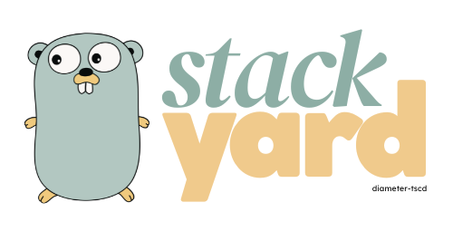

<div align="center">
  
</div>
<div align="center">
  
  
  
  
  
</div>
<br>

Stackyrd provides an enterprise-grade service fabric foundation for building robust and observable distributed systems in Go. Our goal is to bridge the gap between rapid development cycles and industrial-strength stability, making complex microservices architectures manageable from day one.

## Quick Start

### Installation & Run

```bash
# Clone the repository
git clone https://github.com/diameter-tscd/stackyrd.git
cd stackyrd

# Install dependencies
go mod download

# Run the application
go run cmd/app/main.go

# To build the application
go run scripts/build/build.go

```

## Preview


## Key Features

- **Modular Services**: Enable/disable services via configuration
- **Terminal UI**: Interactive boot sequence and live CLI dashboard
- **Infrastructure Support**: Redis, PostgreSQL (multi-tenant), Kafka, MinIO and many more at `stackyrd-pkg`
- **Security**: API encryption, authentication, and access controls
- **Build Tools**: Automated build scripts with backup and archiving with `build.go`

## Documentation

**[Full Documentation](docs_wiki/)** - Comprehensive guides and references

## Project Structure

```
stackyard/
├── .github/                 # GitHub Actions CI/CD workflows
│   └── workflows/          # Automated testing and deployment
├── cmd/                     # Application entry points
│   └── app/                # Main application executable
├── config/                  # Configuration management
├── docs_wiki/              # Comprehensive project documentation
│   └── blueprint/          # Project architecture analysis
├── internal/                # Private application packages
│   ├── middleware/         # HTTP middleware (auth, security)
│   ├── monitoring/         # Web monitoring dashboard backend
│   ├── server/             # HTTP server setup and routing
│   └── services/           # Modular business services
│       └── modules/        # Individual service implementations
├── pkg/                    # Public reusable packages
│   ├── infrastructure/     # External service integrations
│   ├── logger/             # Structured logging utilities
│   ├── request/            # Request validation and binding
│   ├── response/           # Standardized API responses
│   ├── tui/                # Terminal User Interface components
│   └── utils/              # General utility functions
├── scripts/                # Build and utility scripts
└── web/                    # Web interface assets
    └── monitoring/         # Monitoring dashboard frontend
        └── assets/         # Static web assets
            ├── css/        # Stylesheets
            └── js/         # JavaScript files
```

## License

Apache License Version 2.0: [LICENSE](LICENSE)

---

**Built using Go, Echo, Alpine.js, Tailwind CSS**
