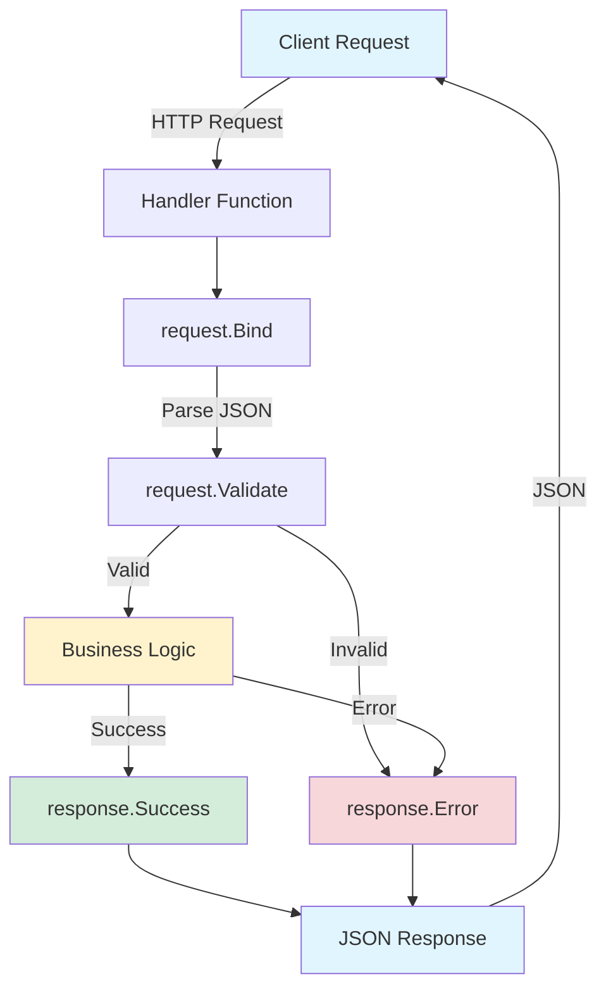
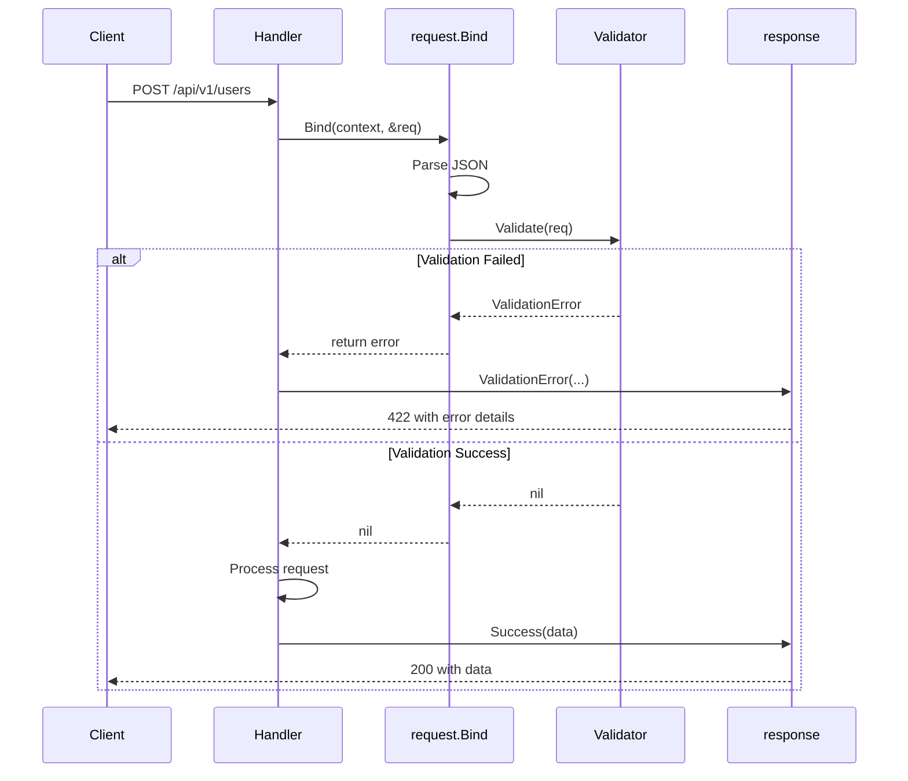
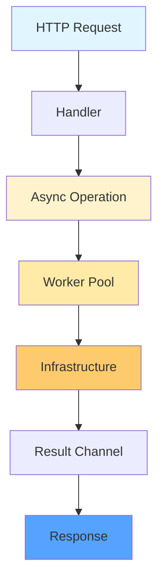
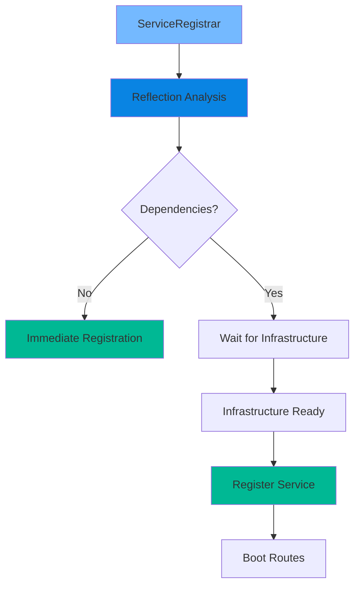
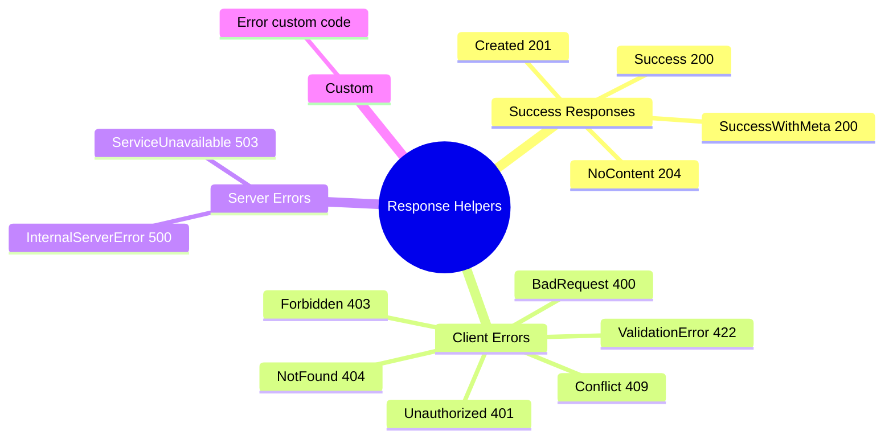
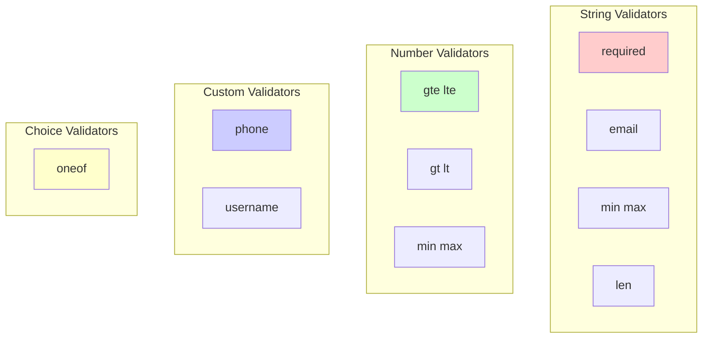

# Request/Response Flow Architecture



## Response Structure

```mermaid
classDiagram
    class Response {
        +bool success
        +string message
        +interface{} data
        +ErrorDetail error
        +Meta meta
        +int64 timestamp
    }

    class ErrorDetail {
        +string code
        +string message
        +map details
    }

    class Meta {
        +int page
        +int per_page
        +int64 total
        +int total_pages
        +map extra
    }

    Response --> ErrorDetail
    Response --> Meta
```

## Request Validation Flow



## Async Infrastructure Flow



## Service Registration Architecture



## Package Organization

```mermaid
graph LR
    A[pkg/request] -->|Validates| F[Handler]
    B[pkg/response] -->|Formats| F
    F -->|Uses| G[Service Logic]
    G -->|Uses| H[Async Infrastructure]
    H -->|Worker Pools| I[Infrastructure Managers]
    G -->|Returns| F

    style A fill:#ffeb9c
    style B fill:#9cf09c
    style H fill:#ffeaa7
    style I fill:#fdcb6e
    style F fill:#9cccff
    style G fill:#ff9c9c

## Complete CRUD Example Flow

```mermaid
graph TD
    subgraph "GET /api/v1/users (List)"
        A1[Parse Pagination] --> A2[Fetch Data]
        A2 --> A3[Calculate Meta]
        A3 --> A4[SuccessWithMeta]
    end

    subgraph "GET /api/v1/users/:id (Detail)"
        B1[Get ID from URL] --> B2[Find in DB]
        B2 -->|Found| B3[Success]
        B2 -->|Not Found| B4[NotFound]
    end

    subgraph "POST /api/v1/users (Create)"
        C1[Bind & Validate] --> C2{Valid?}
        C2 -->|No| C3[ValidationError]
        C2 -->|Yes| C4[Create in DB]
        C4 --> C5[Created 201]
    end

    subgraph "PUT /api/v1/users/:id (Update)"
        D1[Get ID + Bind] --> D2{Valid?}
        D2 -->|No| D3[ValidationError]
        D2 -->|Yes| D4[Update in DB]
        D4 --> D5[Success]
    end

    subgraph "DELETE /api/v1/users/:id (Delete)"
        E1[Get ID] --> E2[Delete from DB]
        E2 --> E3[NoContent 204]
    end

    style A4 fill:#d4edda
    style B3 fill:#d4edda
    style B4 fill:#f8d7da
    style C3 fill:#f8d7da
    style C5 fill:#d4edda
    style D3 fill:#f8d7da
    style D5 fill:#d4edda
    style E3 fill:#d4edda
```

## Response Helper Functions Map



## Validation Tags Reference


